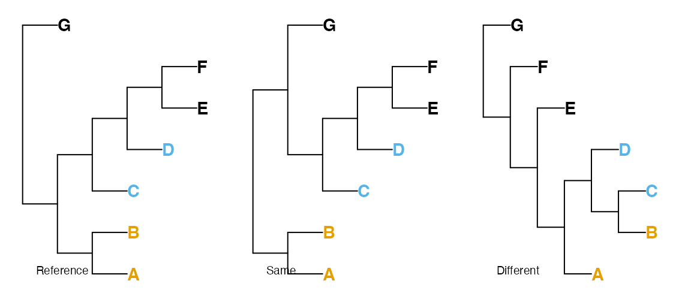

# About the quartet distance

## Partition distances

The Robinson-Foulds (RF or ‘partition’) metric (Robinson & Foulds, 1981;
Steel & Penny, 1993) measures the symmetric difference between two trees
by adding the number of splits (i.e. groupings) that are present in tree
A (but not tree B) to the number of splits present in tree B (but not
tree A).

It is most useful when the trees to be compared are very similar; it has
a low range of integer values, and a low maximum value, limiting its
ability to distinguish between trees (Steel & Penny, 1993); and it
treats all splits as equivalent, even though some are more informative
than others. Various other artefacts and biases limit its performance
against a suite of real-world benchmarks (Smith, 2020, 2022). These
shortcomings can largely be mitigated through generalizations of the
Robinson-Foulds distance (see R package
‘[TreeDist](https://ms609.github.io/TreeDist/)’), but the complementary
perspective on tree similarity offered by a quartet-centred approach can
be illuminating.

## Quartet distances

Instead of partitions, symmetric differences can be measured by counting
the number of four-taxon statements (quartets) that differ between two
trees (Day, 1986; Estabrook et al., 1985).

For any four tips A, B, C and D, a split on a bifurcating tree will
separate tip A and either B, C or D from the other two tips. That is to
say, removing all other tips from the tree will leave one of these three
trees:


Thus two of the random trees below share the quartet `(A, B), (C, D)`,
whereas the third does not; these four tips are divided into
`(A, D), (B, C)`.



There are $\left( \frac{n}{4} \right)$ groups of four taxa in a tree
with $n$ tips; for each of these groups, one of the three trees above
will be consistent with a given tree. As such, two identical trees will
have a quartet distance of 0, and a random pair of trees will have an
expected $\left( \frac{n}{4} \right)/3$ quartets in common. Because
quartets are not independent of one another, no pair of trees with six
or more tips can have all $\left( \frac{n}{4} \right)$ quartets in
common (Steel & Penny, 1993).

Properties of the quartet distance are explored fully in Steel & Penny
(1993). As quartet distances of 1 can only be accomplished for small
trees (five or fewer leaves; see below), it is perhaps more appropriate
to consider whether or not trees are more dissimilar than a pair of
random trees, whose distance will be, on average, $\frac{2}{3}$. (Data
from real trees, and comparisons with expected values of other metrics,
are available
(here)\[<https://ms609.github.io/TreeDistData/articles/09-expected-similarity.html>\].)

## Normalization

Whereas counting quartets is simple, accounting for resolution is not.
Two trees will have few quartet statements in common if they are well
resolved and differ in many details; or if they are poorly resolved but
in perfect agreement. As such, it is important to normalize quartet
distances in a meaningful fashion. A number of normalizations have been
proposed (Day, 1986; Estabrook et al., 1985); arguably the most
appropriate is the Symmetric Quartet Divergence (Smith, 2019), which
represents the total number of quartets unique to each tree normalized
against the total number of quartets that could have been resolved. The
[`SimilarityMetrics()`](../reference/SimilarityMetrics.md) documentation
page gives further details.

## Asymmetric differences

Metric distances are necessarily symmetric – that is, the distance from
tree A to tree B equals the distance from B to A. This behaviour is not
necessarily desirable when one tree represents a known ‘reference’ –
such as a tree validated by independent data, or a tree used to simulate
data in order to test phylogenetic reconstruction techniques.

In such cases, a tree might be evaluated according to the likelihood
that a randomly chosen quartet is resolved correctly by the tree, where
an uncertain resolution in either the reference or comparison tree is
taken as having a 1/3 chance of being correct (Asher & Smith
forthcoming). More details are given at the
[`SimilarityMetrics()`](../reference/SimilarityMetrics.md) documentation
page.

### Quartet similarity in a pair of random trees

On average, $\frac{1}{3}$ of the quartets resolved in a pair of random
trees will match. This is because there are three quartets involving any
set of four tips, each of which is equally likely to occur on a truly
random tree.

The below code calculates the mean proportion of matching quartets
between 10 random trees (90 pairs) with 4 to 20 leaves, and the
corresponding standard deviation.

``` r
round(vapply(4:20, function (nTip) {
 trees <- lapply(rep(nTip, 10), TreeTools::RandomTree)
 s <- ManyToManyQuartetAgreement(trees)[, , 's']
 results <- s[lower.tri(s)] / choose(nTip, 4)
 c(mean(results), sd(results))
}, c(mean = 0, sd = 0)), 3)
```

    ##       [,1]  [,2]  [,3]  [,4]  [,5]  [,6]  [,7]  [,8]  [,9] [,10] [,11] [,12]
    ## mean 0.311 0.378 0.311 0.367 0.347 0.317 0.334 0.359 0.346 0.329 0.343 0.339
    ## sd   0.468 0.257 0.194 0.157 0.112 0.087 0.092 0.106 0.080 0.061 0.066 0.049
    ##      [,13] [,14] [,15] [,16] [,17]
    ## mean 0.335  0.34 0.344 0.340 0.339
    ## sd   0.044  0.06 0.048 0.045 0.029

## Independence

One possible criticism of the quartet distance is that not all
individual quartet statements are independent. For example, the quartet
statements `AB | CD` and `AB | CE` together imply `AB | DE`. A simple
count of identical quartets therefore includes some redundant
information. This prevents a straightforward information theoretic
interpretation of the quartet distance.

## Minimum quartet similarity

As a related phenomenon, when there are six or more tips in a
bifurcating tree, some quartets are necessarily shared between trees.

Consider the tree:

``` r
tree_a <- ape::read.tree(text = "((1, 2), (3, (4, 5)));")
```


The only trees with no quartets in common with Tree A are symmetric with

``` r
tree_b <- ape::read.tree(text = "((1, 5), (3, (2, 4)));")
```


Now create Tree C by adding a 6^(th) tip as a sister to tip `3` on Tree
A.

``` r
tree_c <- ape::read.tree(text="((1, 2), ((3, 6), (4, 5)));")
```


There’s nowhere to add tip `6` to Tree B without creating a quartet that
exists in Tree C.


As such, the minimum possible quartet similarity is non-zero, and
becomes increasingly difficult to compute as the number of leaves rises.
This fact increases the value of comparing low quartet similarity scores
to the expected similarity of a pair of random trees
(i.e. $\frac{1}{3}$), rather than to zero.

## References

Day, W. H. E. (1986). Analysis of quartet dissimilarity measures between
undirected phylogenetic trees. *Systematic Biology*, *35*(3), 325–333.
<https://doi.org/10.1093/sysbio/35.3.325>

Estabrook, G. F., McMorris, F. R., & Meacham, C. A. (1985). Comparison
of undirected phylogenetic trees based on subtrees of four evolutionary
units. *Systematic Zoology*, *34*(2), 193–200.
<https://doi.org/10.2307/2413326>

Robinson, D. F., & Foulds, L. R. (1981). Comparison of phylogenetic
trees. *Mathematical Biosciences*, *53*(1-2), 131–147.
<https://doi.org/10.1016/0025-5564(81)90043-2>

Smith, M. R. (2019). Bayesian and parsimony approaches reconstruct
informative trees from simulated morphological datasets. *Biology
Letters*, *15*, 20180632. <https://doi.org/10.1098/rsbl.2018.0632>

Smith, M. R. (2020). Information theoretic Generalized Robinson-Foulds
metrics for comparing phylogenetic trees. *Bioinformatics*, *36*(20),
5007–5013. <https://doi.org/10.1093/bioinformatics/btaa614>

Smith, M. R. (2022). Robust analysis of phylogenetic tree space.
*Systematic Biology*, *71*(5), 1255–1270.
<https://doi.org/10.1093/sysbio/syab100>

Steel, M. A., & Penny, D. (1993). Distributions of tree comparison
metrics—some new results. *Systematic Biology*, *42*(2), 126–141.
<https://doi.org/10.1093/sysbio/42.2.126>
